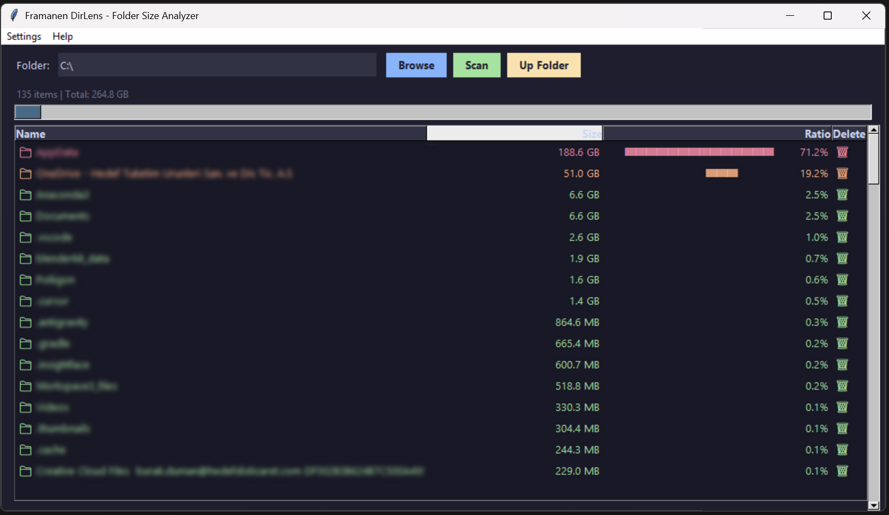

# Framanen DirLens - Folder Size Analyzer

**Framanen DirLens** is a lightweight, fast, and feature-rich desktop application designed to scan folders, analyze disk usage, and help you find which files and folders are occupying the most space. 

Developed by **Burak Duman**, this tool is open-source and completely free to use.

---

## 📸 Screenshot



---

## 🚀 Key Features

* **Fast Scan:** Recursively scans and calculates folder sizes with real-time progress indicators.
* **Size Visualization:** Shows folder and file sizes along with a color-coded percentage ratio bar chart.
* **Interactive Navigation:** 
  * Double-click a folder to navigate down and scan its contents.
  * Click the **Up Folder** button to quickly go up one directory level.
  * Double-click a file to open it with your system's default application.
* **Actionable Deletion:** Click the trash bin icon (`🗑️`) next to any item to delete it permanently after a safe confirmation prompt.
* **Multi-Language Support:** Change the application language on-the-fly via the menu bar.

---

## 🌐 Supported Languages

You can switch between **7 different languages** dynamically from the **Settings (Ayarlar)** menu:
* 🇹🇷 Turkish (Türkçe)
* 🇺🇸 English
* 🇪🇸 Spanish (Español)
* 🇩🇪 German (Deutsch)
* 🇰🇷 Korean (한국어)
* 🇨🇳 Chinese (中文)
* 🇮🇹 Italian (Italiano)

---

## 📦 How to Run

### For End-Users (No Python Required)
You can directly run the pre-compiled executable file:
1. Go to the `dist/` folder in this repository.
2. Download and run **`Framanen_DirLens.exe`**.

### For Developers
If you want to run the python source code:
1. Clone this repository:
   ```bash
   git clone https://github.com/BurakDuman1980/Framanen-DirLens.git
   ```
2. Navigate to the project directory:
   ```bash
   cd Framanen-DirLens
   ```
3. Run the script (requires Python 3.x with Tkinter):
   ```bash
   python klasor_boyutu.py
   ```

---

## 🛠️ Build from Source
If you want to package your own `.exe` file using PyInstaller:
```bash
pip install pyinstaller
pyinstaller --onefile --noconsole klasor_boyutu.py
```
The executable will be generated inside the `dist/` directory.

---

## 📄 License

This project is open-source and free to use. Feel free to clone, modify, and distribute!
