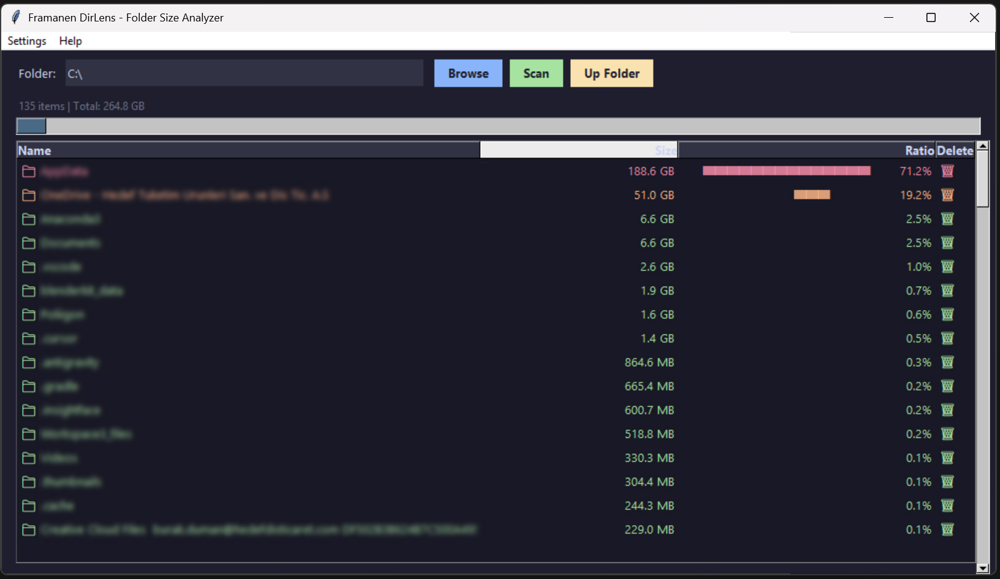
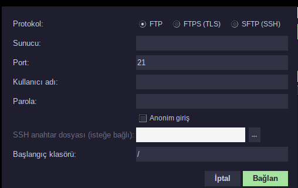

# Framanen DirLens - Folder Size Analyzer

**Version 2.0.0**

**Framanen DirLens** is a lightweight, fast, and feature-rich desktop application designed to scan folders, analyze disk usage, and help you find which files and folders are occupying the most space — on your **local disks**, on an **FTP / FTPS server**, or on an **SSH (SFTP) server**. 

Developed by **Burak Duman**, this tool is open-source and completely free to use.

---

## 📸 Screenshots



The FTP / SSH connection dialog added in 2.0.0:



---

## 🚀 Key Features

* **Fast Scan:** Recursively scans and calculates folder sizes with real-time progress indicators.
* **Remote Scan (new in 2.0.0):** Connect to an **FTP**, **FTPS (TLS)** or **SFTP (SSH)** server and see remote folder and file sizes exactly the way you see local ones.
* **Stop Button:** Cancel a long-running scan at any time — useful for large remote directory trees.
* **Size Visualization:** Shows folder and file sizes along with a color-coded percentage ratio bar chart.
* **Interactive Navigation:** 
  * Double-click a folder to navigate down and scan its contents.
  * Click the **Up Folder** button to quickly go up one directory level.
  * Double-click a file to open it with your system's default application.
* **Actionable Deletion:** Click the trash bin icon (`🗑️`) next to any item to delete it permanently after a safe confirmation prompt.
* **Multi-Language Support:** Change the application language on-the-fly via the menu bar.

---

## 🌍 How to See Folder and File Sizes over FTP / SSH

1. Open the **Connection** menu and choose **FTP / SSH Connection...**
2. Pick the protocol:
   * **FTP** — plain FTP (default port 21)
   * **FTPS (TLS)** — FTP over TLS (default port 21)
   * **SFTP (SSH)** — file transfer over SSH (default port 22)
3. Fill in host, port, username and password. For SFTP you may instead pick a
   private key file, or leave the password empty to use your SSH agent / default
   keys. For public FTP servers, tick **Anonymous login**.
4. Enter the folder you want to start in (for example `/` or `/var/www`) and click **Connect**.

The listing then works just like local mode: every folder is measured
recursively and shown with its size and percentage bar, double-click a folder to
go into it, use **Up Folder** to go back, and the trash icon deletes an item on
the server after a confirmation prompt. Press **Stop** to cancel a scan that is
taking too long. Choose **Connection → Local Disk** (or **Disconnect**) to return
to your own machine.

Notes:
* Remote sizes are calculated by walking the tree over the connection, so a deep
  remote folder can take a while — that is what the **Stop** button is for.
* FTP sizes come from the `MLSD` command when the server supports it, with an
  automatic fallback to parsing `LIST` output (both UNIX and MS-DOS style).
* Remote files cannot be opened by double-clicking; download them first.
* SFTP host keys are loaded from your known_hosts file, and unknown hosts are
  accepted automatically on first connect.

---

## 🌐 Supported Languages

You can switch between **7 different languages** dynamically from the **Settings (Ayarlar)** menu:
* 🇹🇷 Turkish (Türkçe)
* 🇺🇸 English
* 🇪🇸 Spanish (Español)
* 🇩🇪 German (Deutsch)
* 🇰🇷 Korean (한국어)
* 🇨🇳 Chinese (中文)
* 🇮🇹 Italian (Italiano)

---

## 📦 How to Run

### For End-Users (No Python Required)
You can directly run the pre-compiled executable file:
1. Go to the `dist/` folder in this repository.
2. Download and run **`Framanen_DirLens.exe`** (or the zipped copy, `klasor_boyutu.zip`).

The published executable is the **2.0.0** build for **64-bit Windows**. It bundles
Python, Tkinter and Paramiko, so the local, FTP, FTPS and SFTP (SSH) modes all
work without installing anything else.

```
File   : dist/Framanen_DirLens.exe
Version: 2.0.0
Size   : 16,199,976 bytes
SHA-256: eacae3f2adf375f5f70d2d13dae848ab60a14de213144636b7288a2adc7cba5f
```

### For Developers
If you want to run the python source code:
1. Clone this repository:
   ```bash
   git clone https://github.com/BurakDuman1980/Framanen-DirLens.git
   ```
2. Navigate to the project directory:
   ```bash
   cd Framanen-DirLens
   ```
3. Install the optional dependency for SSH (SFTP) mode — local disk, FTP and
   FTPS work with the standard library alone:
   ```bash
   pip install -r requirements.txt
   ```
4. Run the script (requires Python 3.x with Tkinter):
   ```bash
   python klasor_boyutu.py
   ```

---

## 🛠️ Build from Source
If you want to package your own `.exe` file using PyInstaller:
```bash
pip install pyinstaller paramiko
pyinstaller --onefile --noconsole --hidden-import paramiko klasor_boyutu.py
```
The executable will be generated inside the `dist/` directory. Drop
`--hidden-import paramiko` if you do not need SSH (SFTP) support.

The `dist/Framanen_DirLens.exe` committed in this repository was produced with
exactly this command, so rebuilding is only necessary after changing the source.

---

## 📝 Changelog

### 2.0.0
* Added FTP, FTPS (TLS) and SFTP (SSH) modes with a connection dialog.
* Remote folder and file sizes, navigation and deletion, same UI as local mode.
* Added a **Stop** button to cancel long scans.
* Added a connection indicator line under the toolbar.
* SSH connections use exactly the credential you provide; the SSH agent and
  your default key files are only tried when no password and no key file is given.
* Files now open with the system default application on Linux and macOS too.
* All 7 languages updated with the new interface texts.
* `dist/Framanen_DirLens.exe` rebuilt from the 2.0.0 source with Paramiko bundled.

### 1.0.0
* Initial release: local folder scanning, size ratio bars, deletion and 7 languages.

---

## 🧭 For Contributors

[PROJECT.md](PROJECT.md) documents the internals in Turkish: architecture, the
storage-backend contract shared by the local / FTP / SFTP modes, the scan and
threading flow, how the 7 language dictionaries fit together, packaging notes
and the testing approach.

---

## 📄 License

This project is open-source and free to use. Feel free to clone, modify, and distribute!
